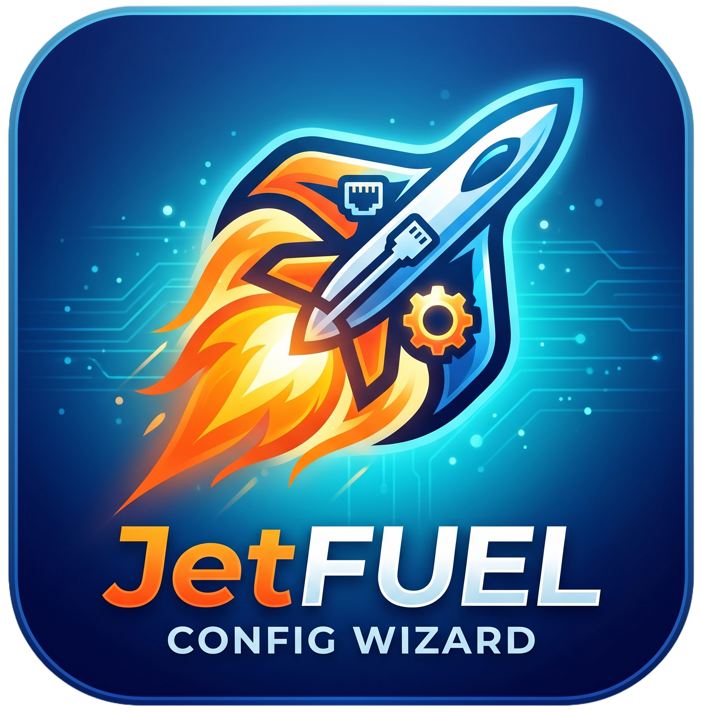

# JetFUEL

<p align="center">
  
</p>

JetFUEL is a Windows 10/11 PowerShell setup wizard for installing Tailscale on a JetKVM.

It is designed for non-technical users: the wizard walks through prechecks, SSH key setup, the required JetKVM UI steps, and the Tailscale install flow.

## Quick Start

Open PowerShell as Administrator, then run:

```powershell
irm https://raw.githubusercontent.com/GoblinRules/JetFUEL/main/Install-JetFuel.ps1 | iex
```

That bootstrap downloads JetFUEL into:

```text
%LOCALAPPDATA%\JetFUEL
```

Then it launches the wizard.

Administrator PowerShell is recommended because the bootstrap may need to install or detect Windows prerequisites such as Git Bash.

## Run From A Local Clone

```powershell
powershell.exe -NoProfile -ExecutionPolicy Bypass -File .\JetFuel.ps1
```

## What It Does

- Checks for Git Bash or WSL bash.
- Offers to install Git for Windows with `winget` if Git Bash is missing.
- Checks for Windows SSH tools.
- Creates an SSH key pair when needed.
- Copies the public key so it can be pasted into JetKVM Developer Mode.
- Checks JetKVM network, web UI, and SSH reachability.
- Guides the required JetKVM UI steps.
- Runs the JetKVM Tailscale installer.
- Supports optional Tailscale auth keys.
- Supports optional Tailscale hostname naming.
- Supports clean Tailscale installs.
- Provides Tailscale check, repair, and remove actions.
- Checks and repairs the JetKVM Tailscale boot hook at `/userdata/init.d/S22tailscale`.
- Keeps colour-coded logs and a copy-log button.

## Wizard Flow

1. Enter the JetKVM IP address or hostname.
2. Click `Run preflight` in Step 1.
3. Create or select an SSH key.
4. Click `Copy public key`.
5. Open the JetKVM UI.
6. In JetKVM Settings > Advanced, enable Developer Mode and paste the SSH public key.
7. Save the JetKVM settings.
8. Choose Tailscale options.
9. Click `Step 5 - Run install`.

After Tailscale is online, you can remove the SSH public key from JetKVM or disable Developer Mode again if you do not need SSH access.

## Installer Script Sources

Step 3 lets you choose which install script to use:

- `Official JetKVM`: downloads JetKVM's current hosted installer script.
- `JetFUEL repo`: uses the local reference copy stored in this repository.
- `Custom URL`: downloads a compatible custom script URL configured in Settings.
- `Local file`: runs a compatible local script configured in Settings.

The default is `Official JetKVM`.

The repository includes a copy of JetKVM's installer script as `install-tailscale.sh`. It is included as a reference/fallback in case JetKVM changes the hosted script later. Because the upstream script does not publish a separate script version, JetFUEL records a fetch timestamp and SHA256 hash in `install-tailscale.metadata.json`.

Custom scripts must keep the same command-line contract:

```text
[-v|--version <tailscale-version>] [-y|--yes] [-c|--clean] <JetKVM-IP> [-- <tailscale up args...>]
```

They must install/configure Tailscale on the JetKVM, handle reboot/return, and print any Tailscale login URL.

## Tailscale Auth Key Notes

Tailscale auth keys are optional.

Use the auth key checkbox only when you have a pre-authentication key from the Tailscale admin console. It should usually start with:

```text
tskey-auth-
```

The key ID shown in the Tailscale admin table, often ending in `CNTRL`, is not enough.

## Troubleshooting

- Run PowerShell as Administrator for the smoothest setup.
- If Git Bash is missing, JetFUEL can install Git for Windows only when `winget` is installed and working.
- If `winget` says the application cannot be started, use the wizard's App Installer repair option to open the Microsoft Store and install/reinstall App Installer, or choose the Git download option and install Git for Windows manually.
- If the JetKVM stays in `NeedsLogin`, use `Check Tailscale` and look for a login URL in the status log.
- If Tailscale goes offline after a reboot, use `Check Tailscale` to verify `/userdata/init.d/S22tailscale`, then use `Repair Tailscale` to recreate the boot hook and rerun `tailscale up`.
- Tailscale auth keys must be full pre-authentication secrets beginning with `tskey-auth-`. The key ID ending in `CNTRL` is not enough.
- Tailscale installation may fail if the JetKVM itself is set up/authenticated using Google auth. Use local JetKVM authentication for this SSH/Developer Mode flow.
- If SSH login fails, confirm Developer Mode is enabled, the public key was saved in JetKVM Settings > Advanced, and the selected private key matches the public key.

## Disclaimer

JetFUEL is an unofficial helper tool. It is not made by, endorsed by, or supported by JetKVM or Tailscale.

This tool enables Developer Mode SSH on your JetKVM as part of the setup flow. Developer Mode can weaken device security while enabled. Review the steps before running them, and disable Developer Mode or remove the SSH key afterwards if you do not need ongoing SSH access.

Use at your own risk. You are responsible for reviewing scripts before running them, especially when using `irm | iex`, custom installer URLs, or local installer scripts.

## License

This project is licensed under the MIT License. See [LICENSE](LICENSE).
